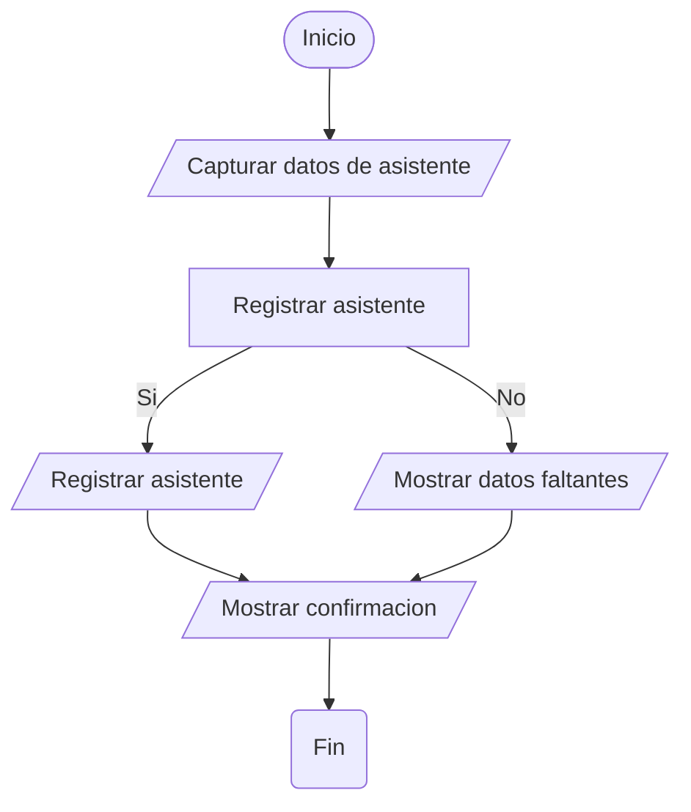

```mermaid
flowchart TB
A([Inicio]) --> B[/Capturar datos de asistente /]
B --> C[Registrar asistente]
C --> |Si| D[/Registrar asistente/]
D --> E[/Mostrar confirmacion/]
C --> |No| F[/Mostrar datos faltantes/]
E --> G(Fin)
F --> E
```